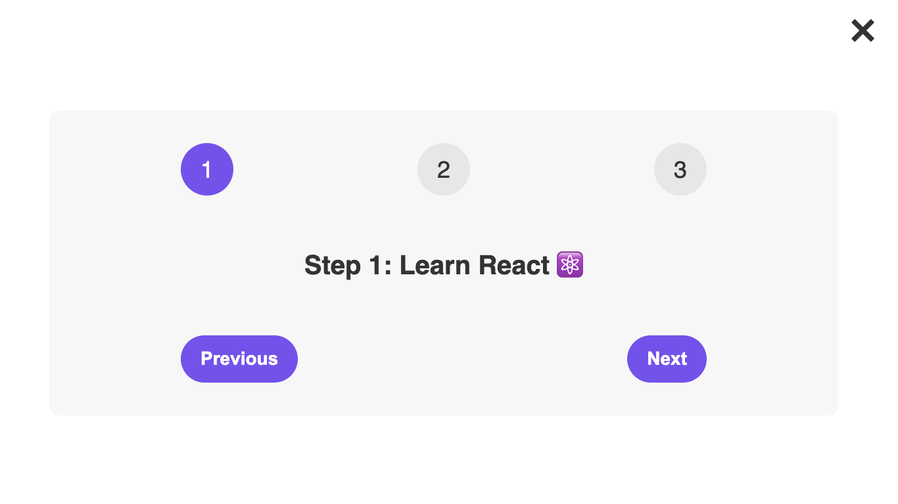

# React State Example Project

- `Repository:` [02-0-learn-react-steps](https://02-0-learn-react-steps.vercel.app/)
- `Deployment:` [Vercel](https://02-0-learn-react-steps.vercel.app/)

## Description

This very small introductory React project showcases how to manage and update state within a functional component using the `useState hook`.

The project utilizes a simple step-based UI to help users understand the principles of state and how it affects the rendering of components. It is part of the online course ["The Ultimate React Course 2023: React, Redux, & More"](https://www.udemy.com/share/108PTK3@svd7LSKS9ey6F-mAoiPwPf0maT7NoRyTUO4HqpNWgU6hsdF-ESPRYJMbg9njS0DY-g==/) by Jonas Schmedtmann on Udemy.

## ⚙️ Technologies

    

## Learning objectives of this project:

The project demonstrates the following key concepts of React:

- Using the `useState hook` to manage state within functional components.
- Rendering different steps of a user interface based on the current state.
- Implementing previous and next buttons to navigate between steps.
- `Conditional rendering` to display components based on a condition (open/close).

